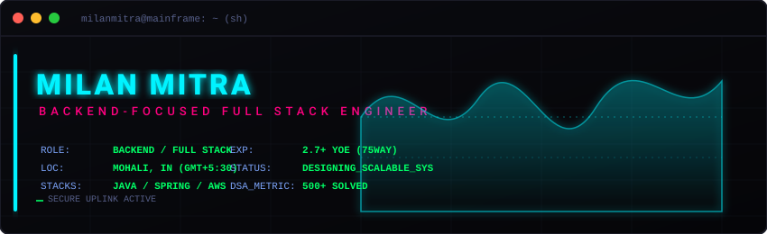

<div align="center">
  <!-- Dynamic Cyberpunk Banner -->
  
</div>

<br/>

<div align="center">
  <p align="center">
    
  </p>
</div>

---

### 0x01 // Systems Diagnostics & Compilation

```bash
milanmitra@mainframe:~$ make brain
g++ -O3 -std=c++20 milan_core.cpp modules.cpp dsa.o -o milan-core
./milan-core --daemonize --ports=80,443,8080

 🧠 [SYSTEM] Loading neural pathways...               [ SUCCESS ]
 ⚡ [KERNEL] Allocating heap memory...                [  64 GB  ]
 💾 [DRIVER] Loading DB interfaces (PgSQL/Mongo)...   [ ACTIVE  ]
 🛡️ [SECURE] Validating JWT & OAuth handshake...      [ VERIFIED]
 ☕ [STATUS] Caffeine level detection...             [ 120% OVERCLOCK ]
```

---

### 0x02 // Mainframe Process Monitor (`htop` simulation)

```text
  CPU[||||||||||||||||||||||||||||||||||||||||||||            74.2%]
  Mem[||||||||||||||||||||||||||||||                          48.6GB/64.0GB]
  Swp[|                                                        1.2GB/16.0GB]

  PID USER      PRI  NI  VIRT   RES   SHR S CPU% MEM%   TIME+  Command
 2026 milan      20   0 12.4g  4.2g  1.2g S 42.1  6.5  8:12.04 java -jar target/spring-boot-app.jar
 1092 milan      20   0  8.8g  2.1g  0.8g S 18.4  3.2  4:05.12 next-router-worker --port 3000
 3051 milan      20   0  6.2g  1.8g  0.6g S 12.0  2.8  2:44.89 node dist/express-api.js
  412 milan      20   0  4.1g  1.1g  0.4g S  4.2  1.7  0:52.31 postgres -D /usr/local/var/postgres
   88 milan      20   0  1.2g  0.3g  0.1g S  1.5  0.4  0:10.15 arduino-cli monitor -p /dev/ttyACM0
```

---

### 0x03 // VCS Commit Pipeline (`git log --graph`)

```text
milanmitra@mainframe:~$ git log --graph --oneline --all --decorate
* 6c7c2b2 (HEAD -> main, origin/main) feat: integrate springboot service modules
* 4f9e1a3 feat: implement EAV catalog schema for dynamic attributes
*   2d8e412 Merge pull request #4 from milan/optimize-db-indexes
|\  
| * a1b2c3d optimize: add composite indexes to postgres catalog queries
| * e4f5a6b fix: resolve memory leaks on next-router connection pool
|/  
* 8c9d0e1 feat: dockerize microservice environment & setups
```

---

### 0x04 // Interactive Terminal Prompt

```bash
milanmitra@mainframe:~$ cat profile.conf
# Core Dev Profile Settings
IDENTITY      = "Milan Mitra"
ROLE          = "Software Engineer"
CURRENT_FOCUS = "Data Structures & Algorithms (DSA)"
ASK_ME_ABOUT  = "Web Development, REST APIs, & Cloud Architecture"
UPLINK_ADDR   = "milanmitra2204@gmail.com"
PORTFOLIO_URI = "https://github.com/MilanMitra2210?tab=repositories"
CREDENTIALS   = "https://drive.google.com/file/d/1EkRCplT7-CXCd8bQXTrm96EAZKRB14yr/view"
```

---

### 0x05 // Core Systems Stacks & Modules

<table align="center" width="100%" style="border-collapse: collapse; border: none;">
  <tr>
    <td valign="top" width="50%" style="border: none;">
      <strong>📟 Backend &amp; Core Systems</strong>
      <br/><br/>
      <a href="https://www.java.com" target="_blank" rel="noreferrer">
        
      </a>
      <a href="https://expressjs.com" target="_blank" rel="noreferrer">
        
      </a>
      <a href="https://nodejs.org" target="_blank" rel="noreferrer">
        
      </a>
      <a href="https://www.php.net" target="_blank" rel="noreferrer">
        
      </a>
      <a href="https://www.cprogramming.com/" target="_blank" rel="noreferrer">
        
      </a>
    </td>
    <td valign="top" width="50%" style="border: none;">
      <strong>🎨 Frontend &amp; Interfaces</strong>
      <br/><br/>
      <a href="https://reactjs.org/" target="_blank" rel="noreferrer">
        
      </a>
      <a href="https://redux.js.org" target="_blank" rel="noreferrer">
        
      </a>
      <a href="https://sass-lang.com" target="_blank" rel="noreferrer">
        
      </a>
      <a href="https://getbootstrap.com" target="_blank" rel="noreferrer">
        
      </a>
      <a href="https://www.w3.org/html/" target="_blank" rel="noreferrer">
        
      </a>
      <a href="https://www.w3schools.com/css/" target="_blank" rel="noreferrer">
        
      </a>
    </td>
  </tr>
  <tr>
    <td valign="top" width="50%" style="border: none;">
      <br/>
      <strong>💾 Databases &amp; Storage</strong>
      <br/><br/>
      <a href="https://www.mongodb.com/" target="_blank" rel="noreferrer">
        
      </a>
      <a href="https://www.mysql.com/" target="_blank" rel="noreferrer">
        
      </a>
      <a href="https://www.sqlite.org/" target="_blank" rel="noreferrer">
        
      </a>
    </td>
    <td valign="top" width="50%" style="border: none;">
      <br/>
      <strong>🛠️ Embedded &amp; Control Tools</strong>
      <br/><br/>
      <a href="https://www.arduino.cc/" target="_blank" rel="noreferrer">
        
      </a>
      <a href="https://git-scm.com/" target="_blank" rel="noreferrer">
        
      </a>
    </td>
  </tr>
</table>

---

### 0x06 // System Status & Engineering Paradigms

```yaml
systems_diagnostics:
  core_kernel:   "██████████████████████████░░░░░ [ 84% STABLE ]"
  neural_link:   "██████████████████████████████░ [ 97% ONLINE ]"
  caffeine_lvl:  "██████████████████████████████ [ 120% OVERCLOCK ]"

engineering_methodologies:
  architecture: [ "Microservices", "RESTful API Design", "EAV Catalog Design" ]
  optimization: [ "Query Performance Tuning", "SSR/ISR Caching", "Asset Lazy-Loading" ]
  security:     [ "Role-Based Access Control (RBAC)", "JWT/OAuth2", "CORS Whitelisting" ]
  cloud_ops:    [ "Asynchronous Media Pipelines", "S3 Presigned Uploads", "CDN Distribution" ]
```

---

### 0x07 // Performance Diagnostics & Metrics

<table align="center" width="100%" style="border-collapse: collapse; border: none;">
  <tr style="border: none;">
    <td align="center" style="border: none;" width="50%">
      
    </td>
    <td align="center" style="border: none;" width="50%">
      
    </td>
  </tr>
  <tr style="border: none;">
    <td align="center" colspan="2" style="border: none;">
      <br/>
      
    </td>
  </tr>
</table>

---

### 0x08 // Comm Gateway Uplinks

<div align="center">
  <a href="https://linkedin.com/in/milan-mitra" target="blank">
    
  </a>
  &nbsp;&nbsp;
  <a href="https://fb.com/milan.nda.3" target="blank">
    
  </a>
  &nbsp;&nbsp;
  <a href="https://instagram.com/milan_mitraa" target="blank">
    
  </a>
  &nbsp;&nbsp;
  <a href="https://www.leetcode.com/milanmitra2210" target="blank">
    
  </a>
  &nbsp;&nbsp;
  <a href="https://auth.geeksforgeeks.org/user/milanmitranda2020" target="blank">
    
  </a>
</div>

<br/>

<div align="center">
  <sub>Designed with 🌌 by <a href="https://github.com/MilanMitra2210">Milan Mitra</a>. Operations pipeline: <b>READY</b>.</sub>
</div>
